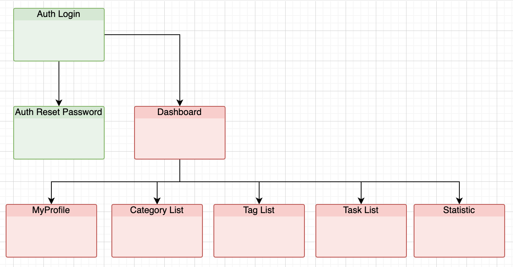
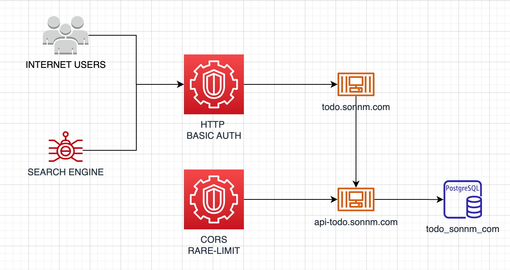

# TODO.SONNM.COM

## Project Overview

- Name: Simple Todolist application
- Description: I need a tools to manage things that i have to read/watch/learn/write/do daily and also i wanna keep track that can i reach my goals my spending time on those daily tasks.

## Goals

- Tools to manage todo list and keep track what has been done
- Stats by categories/tags
- A widget to included in my personal websites as a rating for my skills

### Functional requirements

1. Auth - Login with password
2. Auth - Login with social accounts: google, facebook, linkedin
3. Auth - Reset password
4. My Profile - Change Password
5. My Profile - Link with my social account: google, facebook, linkedin
6. Manage TodoList - CRUD Category
7. Manage TodoList - CRUD Tag
8. Manage TodoList - CRUD Task
9. Statistic - Pending/InProgress/Completed Tasks of Category/Tag Report by date, date-ranges ( in table view )
10. Statistic - Pending/InProgress/Completed Tasks of Category/Tag by days/weeks/months/years ( in chart view )
11. Statistic - Weekly reports 
12. Notification - Daily tasks/Late tasks/New week tasks/No tasks warning
13. Notification - Settings to receive notification by in app/email

### Non-functional requirements

1. Security - HTTP Basic Auth for Application
2. Security - Api Rare Limit
3. Security - CORs
4. Quality - Unit Testing for API
5. Document - Swagger Doc - must secured by HTTP Auth
6. Document - Postman collection and Postman flow
7. Automation - Docker files/Docker compose for environments
8. Automation - Github Actions
9. Storage - File should be stored in S3 services
10. Storage - File should only be access in a short time

### Sitemap

## System Design

### Overview

In general, the system has 3 parts:

1. Frontend application: for me to manage my tickets, of course it should be secured by login
2. Backend API: provide data for the frontend application
3. Database : store my data

### Database structure

